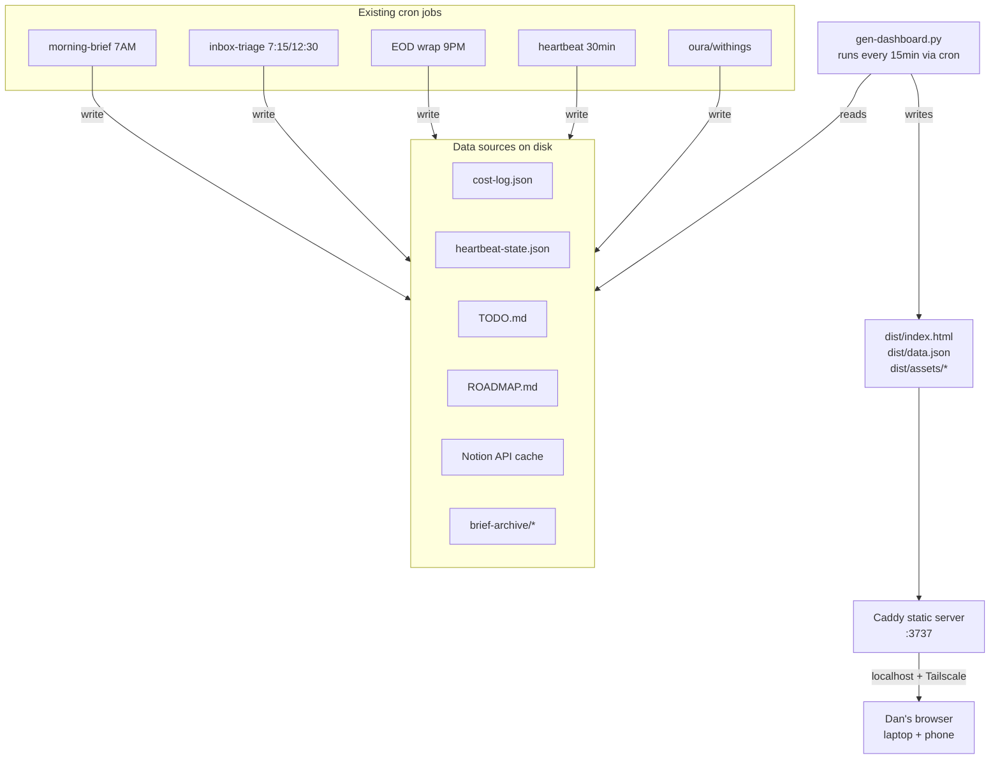
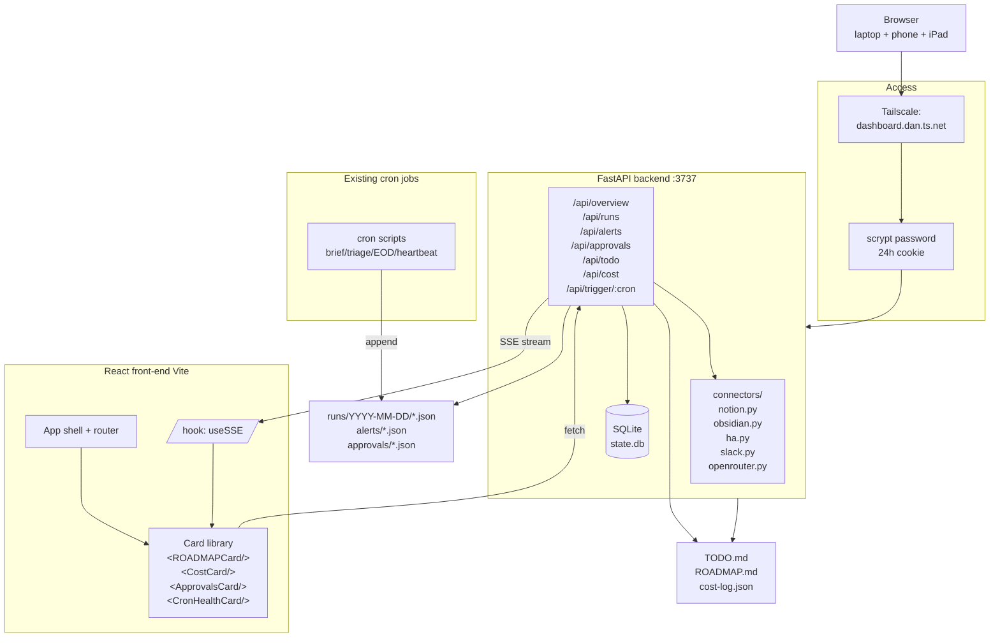
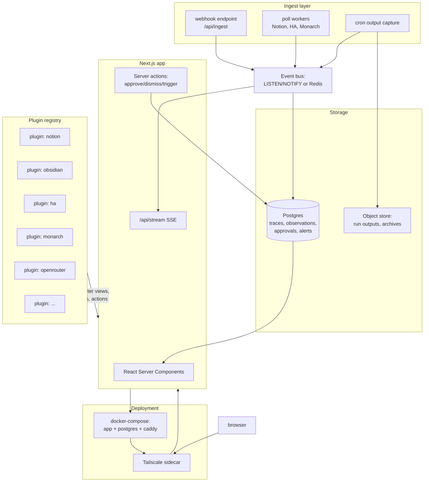

# Agent Command Center — Architecture & Recommendation (Phase 3)

Three architecture shapes Dan could build, each taken seriously. The goal is to pick the one that (a) ships fastest, (b) survives scope growth, (c) respects Dan's real constraint: time, not skill.

---

## Option A — **Lean** (static HTML + generator)

The dashboard is a static HTML bundle regenerated every 15 minutes by a Python script. No server. No API. No auth. Open a file:// URL or a Caddy static site on Tailscale.

### Architecture

### What's in v1
Hand-picked for "read-only is fine":
- **1.1/1.2/1.4** shell, dark theme, card primitive (minimal CSS, no framework)
- **2.1** ROADMAP card · **2.4** travel horizon
- **3.1** TODO render (read-only) · **3.4** overdue escalator
- **5.1** cron last-run · **5.3** heartbeat status
- **6.2/6.3** brief + triage archives (if scripts are augmented to save to disk)
- **7.1/7.2/7.3/7.6** full cost tab
- **9.2** alerts feed (last 24h)
- **10.1 + 10.2** localhost + Tailscale

### Integration plan with current crons
- Add a new cron `*/15 * * * * python3 scripts/gen-dashboard.py` — reads all data sources, renders one big HTML file.
- Minor script tweaks: morning brief, triage, EOD should `tee` their output to `memory/runs/<date>/<job>-<ts>.txt`. One-line change per script.
- Caddy (or `python -m http.server` in a systemd unit) serves `dist/` on port 3737.

### Migration from today
- Day 1: Write the generator. Render cost + ROADMAP + TODO cards. Done.
- Day 2: Tee brief/triage outputs. Add archive cards. Done.
- Done.

### Build time
**~2 evenings.** Very little to get wrong.

### Honest pros/cons for Dan

**Pros**
- Fastest possible to ship. No auth, no server, no state management.
- Zero new tech — it's Python + HTML + static files. Same shape as cost-tracker.py.
- Can't crash in a way that matters. Worst case: HTML is stale.
- Lowest ongoing maintenance cost.

**Cons**
- **Read-only is a hard ceiling.** No quick-add, no approvals inbox with Accept buttons, no run-now. Those need a server.
- Refresh is 15-minute granularity. Fine for cost/ROADMAP, poor for heartbeat.
- No path to v2 without rewriting — the components that need write capability *are* the high-value ones (approvals inbox, TODO write-back, run-now).
- Tailscale access + browser cache will behave weirdly (stale pages). Need `no-cache` headers.

**Verdict:** Lean is the right shape for a proof-of-concept *weekend*. Not the right shape for a system Dan will use daily.

---

## Option B — **Balanced** (Flask backend + React front-end)

Python FastAPI backend reads from existing sources, writes to files + SQLite. React front-end (already scaffolded at `dashboard/`) consumes a `/api/*` surface. Runs as a systemd service on WSL2. Tailscale for access. Scrypt password for auth.

### Architecture

### What's in v1
All 22 v1 components from §2 — this is the release where the full MVP lands.

### Integration plan with current crons
- **Instrument once, benefit forever:** wrap script invocations with a small helper (`scripts/_runner.py`) that captures stdout/stderr, timing, model usage, and writes a structured JSON to `memory/runs/` per run. Retrofit ~8 scripts in one sitting.
- **Approvals schema:** define `memory/approvals/<id>.json` with `{id, created_at, source, title, summary, actions: [{label, href_or_cmd}], expires_at, status}`. Crons that previously asked for approval in Slack now write an approval file *and* ping Slack. Slack remains the interrupt channel; the dashboard is the audit + action channel.
- **Write-back to TODO.md:** backend endpoint `PATCH /api/todo/:id` rewrites the file + commits. Uses the same `gitpython` flow the brain-daily scripts use.
- **Heartbeat becomes multi-sink:** heartbeat writes state to `heartbeat-state.json` (already does) + writes alerts to `memory/alerts/` (new). Dashboard reads alerts.

### Migration from today
1. **Week 1, evening 1:** FastAPI skeleton + `/api/overview` endpoint reading cost-log.json. Wire existing React dashboard to render the cost cards. Throw away the comp-dashboard routing — move comp under `/comp` as one tab. Result: Cost tab live.
2. **Week 1, evening 2:** Retrofit scripts to `_runner.py`. Add `/api/runs`. Build Run Timeline + Brief Archive.
3. **Week 2, evening 1:** ROADMAP + TODO + Travel cards. TODO read-only.
4. **Week 2, evening 2:** Approvals schema. Retrofit 3 crons to write approvals. Approvals inbox card.
5. **Week 2, evening 3:** Auth (scrypt), Tailscale binding, systemd unit, ship.

### Build time
**~5 evenings (20 hours) for v1.** Another 10 hours to polish + v2 features.

### Honest pros/cons for Dan

**Pros**
- Tech Dan already knows: **Python backend** (matches every other script he owns) + **React** (already in repo).
- Approvals inbox and TODO write-back (the two features that move the needle) are possible here; they weren't in Option A.
- Clean extension path: adding a new card is ~50 lines of React + one API route. Feels like Lovelace — a card is a thing you plug in.
- SQLite for state. Portable, backup-able (already in the GitHub workspace repo), no DB to run.
- Auth story is solved (scrypt + Tailscale). Mannys plugin's pattern is copy-paste.
- Doesn't fight Slack — complements it. Dashboard is the *audit + action* surface; Slack stays the *interrupt + chat* surface.

**Cons**
- More moving parts than Option A. systemd unit needs to come up reliably; FastAPI process needs monitoring (heartbeat can do this).
- Real code = real bugs. Budget 1–2 follow-up evenings for bugfixing the first week.
- Requires Dan to retrofit 8 scripts in one pass. Not hard, but it's the highest-friction step.

**Verdict:** This is the Goldilocks option.

---

## Option C — **Platform** (Next.js + shadcn + real-time + plugin architecture)

Next.js 15 app router. shadcn/ui + Tailwind. Postgres (or SQLite via LiteFS) for event storage. Server-Sent Events or websockets for real-time updates. Plugin architecture where new data sources register themselves. Docker Compose for deployment.

### Architecture

### What's in v1
Everything in Option B's v1, plus:
- **9.1 approvals inbox with server actions** (one-click approve without a page reload)
- **5.4 run-now** (safe, because the plugin architecture knows each cron's preconditions)
- **Live updates** via SSE — heartbeat state + new runs stream into the dashboard without refresh

### Integration plan
- Same cron retrofit as Option B.
- Plugins register themselves at boot (`plugins/notion/plugin.ts` exports a `register()` that declares views, polls, actions). Same mental model as Mannys plugin's extension points.
- Postgres (or SQLite with Litestream → S3 for backup) as the source of truth for runs + approvals.

### Build time
**~10–15 evenings for v1.** Plus ongoing maintenance of the plugin API.

### Honest pros/cons for Dan

**Pros**
- Cleanest architecture. Clear contracts. Plugin model is extensible.
- Next.js + shadcn = beautiful out of the box. Real design system.
- Server Components + server actions = fewer bugs around optimistic UI.
- Postgres = proper relational queries (useful if cost analysis gets complex).
- Docker Compose means "I could give this to a friend" — but Dan isn't giving this to anyone.

**Cons**
- **Two new ecosystems to learn** (Next.js 15 RSC if not already fluent; Postgres ops if sticking to real Postgres). Dan is a Salesforce TAD, not a Next.js full-timer.
- Plugin architecture is premium-ware. Dan has ~8 data sources total, and some of them (Oura, Withings, Garmin) are already just file reads. A plugin system is 3x the code for 1.1x the benefit at his scale.
- Docker on WSL2 is fine but adds a layer of indirection — networking quirks, restart timing, log aggregation all get weirder.
- Ongoing update tax: Next.js major releases break things. React 19 → 20 will have to be navigated.
- Real-time is a nice-to-have that eats a disproportionate amount of time. SSE isn't hard, but debugging why a card didn't update on a phone that's been asleep for 4 hours is a 2-hour rabbit hole.

**Verdict:** Over-built for a single-user household dashboard. Right answer if Dan's ever planning to sell this as an OpenClaw plugin. He's not.

---

## Recommendation — **Option B, Balanced**

**Build the Balanced stack.** FastAPI backend, existing Vite + React front-end, SQLite for state, Tailscale + scrypt for access, and a card-based component model.

### Why, in 3 sentences

Dan's constraint is *time-to-first-useful-thing*, not elegance. Option B delivers the two features that would actually change his daily flow — **an approvals inbox** that cuts Slack scroll, and **TODO write-back** that makes the dashboard a useful surface rather than another read-only pane — in roughly 5 evenings, while Option A can't reach them at all and Option C takes 2–3x as long and introduces two new frameworks to a codebase that's already fluent in Python + React. The React skeleton is already installed, cost-log.json is already the right shape for a Langfuse-style trace viewer, and `run_task_flow` / Tailscale / the Mannys-plugin auth pattern are all proven references he can copy wholesale.

### Build order (most-valuable-first)

1. **Cost tab** (1 evening) — fastest possible proof the stack works, and immediately useful for the MAX-vs-API question.
2. **Cron health + heartbeat status** (1 evening) — high signal-to-noise, answers "is anything broken?" in one glance.
3. **Approvals inbox** + retrofit 3 crons to emit approvals (2 evenings) — the feature that justifies the whole project.
4. **ROADMAP + TODO read-only + Travel horizon** (1 evening) — satisfies "what am I supposed to be doing this week?"
5. **Brief archive + run detail page** (later, v2) — useful but not urgent.
6. **TODO write-back + Notion merge + quick-add** (v2).

### Explicit non-goals

- Not building a chat UI. Slack stays the chat.
- Not building a cron editor. Crontab stays the crontab.
- Not building multi-user / RBAC / SSO. One user.
- Not self-hosting Langfuse. Steal the data model; don't run the service.
- Not installing the Mannys plugin *in addition to* this — they overlap on agent/session/config views. If Dan ever wants that surface, install it separately; don't merge.
