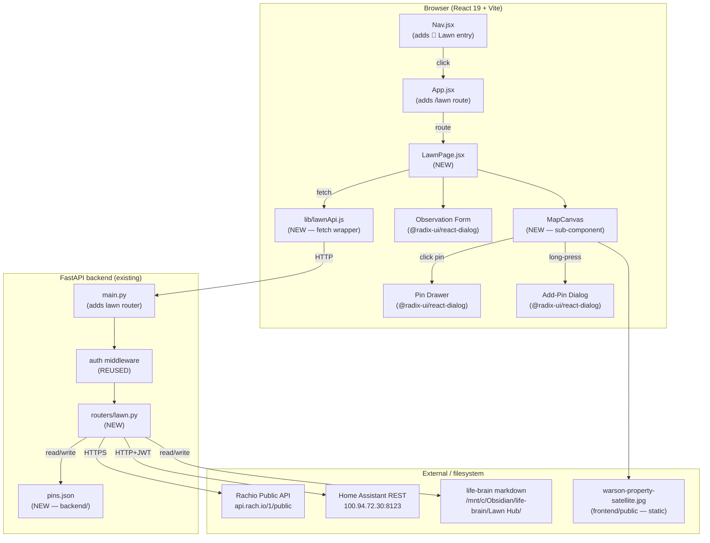
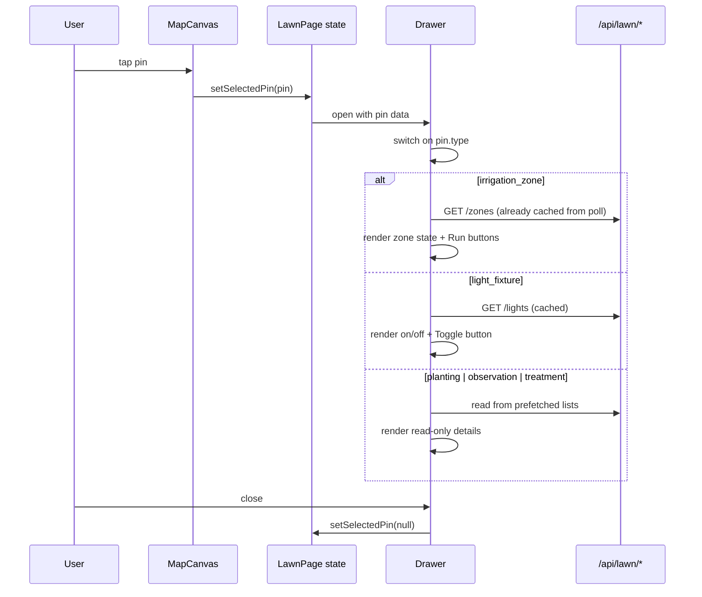
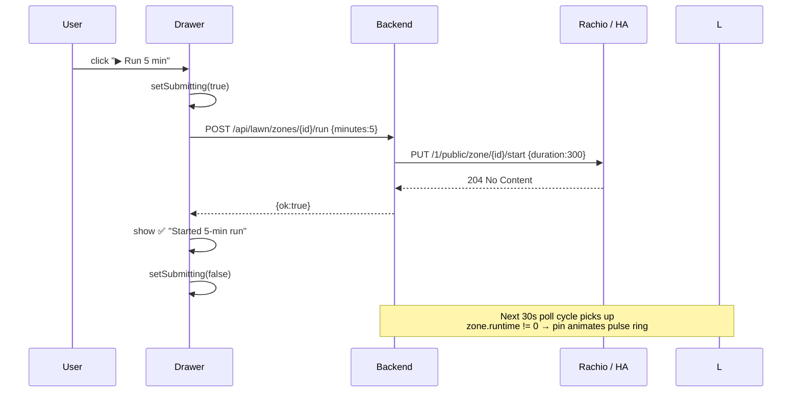

# Lawn Hub — Architecture

## 1. System Diagram

---

## 2. Components Reused (no change)

| Component | Path | Use |
|---|---|---|
| `Sidebar`, `MobileTopBar`, `MobileMenuSheet` | `frontend/src/components/Nav.jsx` | App chrome — no logic change, just a new entry in `NAV` array |
| Auth middleware | `backend/auth.py` | Lawn router automatically protected by the global middleware; no per-route work |
| `Button` | `frontend/src/components/ui/button.jsx` | Action buttons in drawer (Run, Toggle, Save) |
| `cn` util | `frontend/src/lib/utils.js` | Class composition |
| `radix-ui` Dialog re-export | `radix-ui` package | Drawer + Add-Pin + Observation form modals |
| HA token read pattern | `backend/routers/ha.py` (`_read_token`) | Same JWT loaded from `~/.openclaw/secrets/ha.env` |
| Markdown read/write pattern | `backend/routers/home.py` (`_read`, `_write`) | Observation + planting + treatment file IO |
| Static `dist` mount | `backend/main.py` | Serves `warson-property-satellite.jpg` at `/warson-property-satellite.jpg` after build |

## 3. Components Needing Small Extension

| Target | Change |
|---|---|
| `Nav.jsx` `NAV` array | Insert `{ path: "/lawn", label: "Lawn", icon: "🌿" }` after the `/home` entry |
| `App.jsx` `<Routes>` | Add `<Route path="/lawn" element={<LawnPage />} />` and import |
| `backend/main.py` | `from routers import lawn` and `app.include_router(lawn.router, prefix="/api/lawn", tags=["lawn"])` |

No existing logic in those files is modified — these are append-only edits.

## 4. Net-New

| Net-new artifact | Purpose |
|---|---|
| `backend/routers/lawn.py` | All lawn endpoints (pins, zones, lights, observations, plantings, treatments, rain) |
| `backend/pins.json` | Spatial coordinate store (single source of truth for pin positions) |
| `frontend/src/pages/LawnPage.jsx` | Page shell + state machine for selected pin / layer toggles / polling |
| `MapCanvas` (inside LawnPage or split) | Renders the satellite background + absolutely positioned pins |
| `lib/lawnApi.js` | Thin fetch wrapper following the `projectsApi` convention |
| Observation form / Add-pin dialog (inline components) | Two write surfaces for the user |
| `lawn-hub-style.css` (optional, only if Tailwind utilities aren't enough for animate-pulse rings) | Cosmetic only |

## 5. Read Paths

| Data | Source | Endpoint | Refresh |
|---|---|---|---|
| Pin coordinates | `backend/pins.json` | `GET /api/lawn/pins` | On mount |
| Rachio zones (live state) | Rachio Public API: `GET /1/public/device/{device_id}` | `GET /api/lawn/zones` | Every 30s poll |
| Outdoor lights | HA REST `GET /api/states` (filtered) | `GET /api/lawn/lights` | On drawer open + 30s poll |
| Rain sensor | HA REST `GET /api/states/binary_sensor.rachio_7a45b8_new_rain` | `GET /api/lawn/rain` | Every 30s poll |
| Observations (last 30d) | Markdown files in `life-brain/Lawn Hub/observations/` | `GET /api/lawn/observations` | On mount |
| Plantings | Markdown files in `life-brain/Lawn Hub/plantings/` (frontmatter parse) | `GET /api/lawn/plantings` | On mount |
| Treatments (last 90d) | `treatments/weed/*.md` + `treatments/pest/*.md` | `GET /api/lawn/treatments` | On mount |

Backend uses **stdlib only** (`urllib`, `json`, simple line-based YAML frontmatter parser) — no new Python deps.

## 6. Write Paths

| Action | Backend route | Effect |
|---|---|---|
| Run irrigation zone | `POST /api/lawn/zones/{zone_id}/run` body `{minutes}` | `PUT https://api.rach.io/1/public/zone/{zone_id}/start` body `{"duration": minutes*60}` |
| Toggle outdoor light | `POST /api/lawn/lights/{entity_id}/toggle` | HA REST `POST /api/services/light/toggle` body `{"entity_id": ...}` |
| Save updated pins (add-pin flow) | `PUT /api/lawn/pins` | Atomic write to `backend/pins.json` |
| Log observation | `POST /api/lawn/observations` | Append a heading + bullet block to `observations/YYYY-MM-DD.md` (creates file if not exists) |

## 7. Map Pin Click → Detail Drawer Resolution

Each pin carries `entity_ref` in the format `{source}:{collection}:{id}`. The drawer's switch statement parses the source prefix (`rachio:`, `ha:`, `life-brain:`) and looks up live state from the matching cached collection in component state — no per-pin extra fetch.

## 8. Action Launch Confirmation Loop

Failure path: any non-2xx from Rachio / HA → backend returns `{ok:false, error:str}`; drawer renders an inline red error and the button re-enables for retry.

## 9. Build-Time Estimate

| Component | Estimate |
|---|---|
| `pins.json` seed (8+ pins, anchors) | 15 min |
| `routers/lawn.py` (10 endpoints) | 90 min |
| `main.py` wiring | 2 min |
| `LawnPage.jsx` map + pins + layer toggles | 90 min |
| Pin detail drawer (4 type variants) | 60 min |
| Observation form + Add-pin dialog | 45 min |
| 30s polling + last-refreshed indicator | 15 min |
| `lib/lawnApi.js` | 10 min |
| Nav + App.jsx wiring | 5 min |
| Build / smoke test / fix lint | 30 min |
| Handoff doc | 20 min |
| **Total v1** | **~6.5 hours** |

v2 items deferred (websocket HA state, weather radar overlay, Notion mirror, audio zone wiring) ≈ +4 hours.

---

*Architecture compiled 2026-05-03. Reviewed against existing patterns in `routers/ha.py`, `routers/home.py`, `components/ExecuteFlyout.jsx`, `components/Nav.jsx`.*
